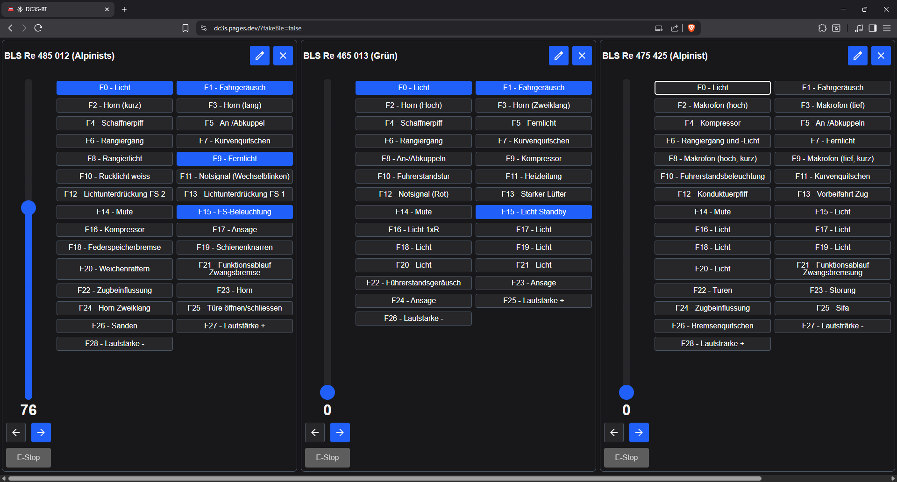
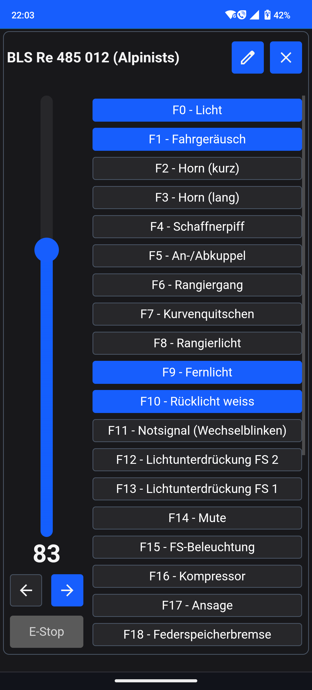

# DC3S

## Digital Command Control Command Station

[Repo/Issues (Codeberg)](https://codeberg.org/nic546/dc3s) | [Mirror (GitHub)](https://github.com/nic547/DC3S-BT) | [Web App](https://dc3s.pages.dev/) | [Web App (Development)](https://preview.dc3s.pages.dev/)

DC3S is an experimental project to DCC command station to combine cheap and widely available Bluetooth enabled microcontroller boards with a WebBluetooth based web application to control model trains.

It's not intended to be a one-size-fits-all solution, rather focusing on the Bluetooth aspect.
Support for DC via Zero-Stretching, RailCom, s88 feedback and many other features are not planned.
If you need a more complete solution or one that doesn't rely on Bluetooth, I can wholeheartedly recommend the [DCC-EX (Website)](https://dcc-ex.com/) | [(GitHub)](https://github.com/DCC-EX/CommandStation-EX) project.

## Supported Hardware

### Microcontroller Boards

- Arduino Uno R4 WiFi

### H-Bridge

- Arduino Motor Shield Rev3 (or similar clones)

### Client Devices

Unfortunately the WebBluetooth API is only supported in chromium based browsers like Chrome, Edge, Brave and others, but should work across Windows, macOS, Linux and Android.

## Plans

Initial plans:

- Support for controlling locomotives (speed 128 steps and 68 functions)
- Support for basic accessory decoders (turnouts and signals)
- Support for reading and writing CVs on a programming track
- Support for Arduino BLE platforms (mostly the Uno WiFi R4 and the Arduino Connect RP2040)
- Basic WebApp for controlling the command station

Further plans:

- Support for 28 and 14 speed steps
- Support for PoM (Programming on Main)
- Support for "joint" operations (combining the main and programming track)
- Support for the Raspberry Pi Pico and/or ESP32 platforms
- Apps for controlling the command station (probably via Tauri or similar)
- Support for extended accessory decoders
- etc ...
